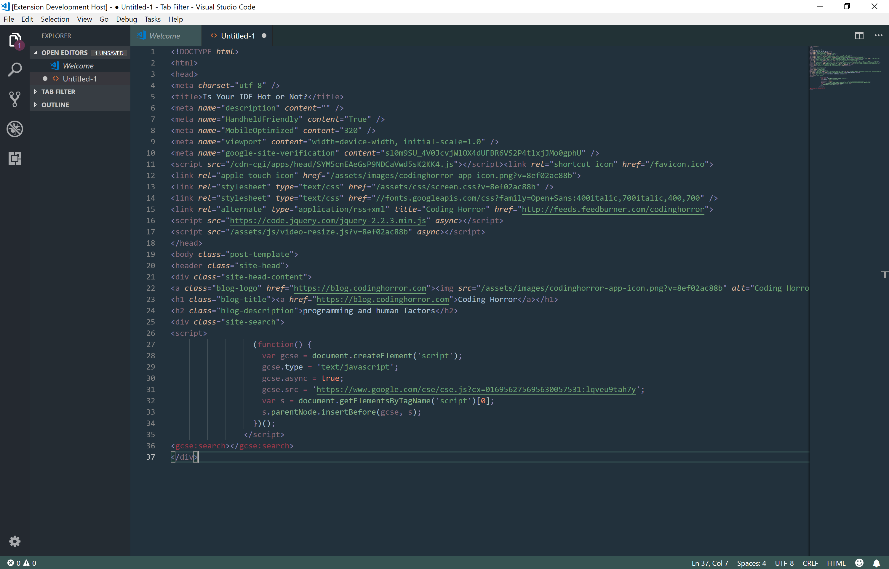

# Space-Mission
## A color theme inspired by the concept of a retro user interface that would be found on a Sci-fi computer screen...in space!

### Sample of Theme:

## Installation

To download the theme:

- Open the `Extensions` menu from the activity bar.
- Search for `space-mission` and install it.

*OR* 

- Press Cmd/Ctrl + Shift + P
- Enter ext install `space-mission`

To activate the theme:

- Press Cmd/Ctrl + Shift + P
- Search for Color Theme and select `space-mission` from the list.

**Enjoy!**
